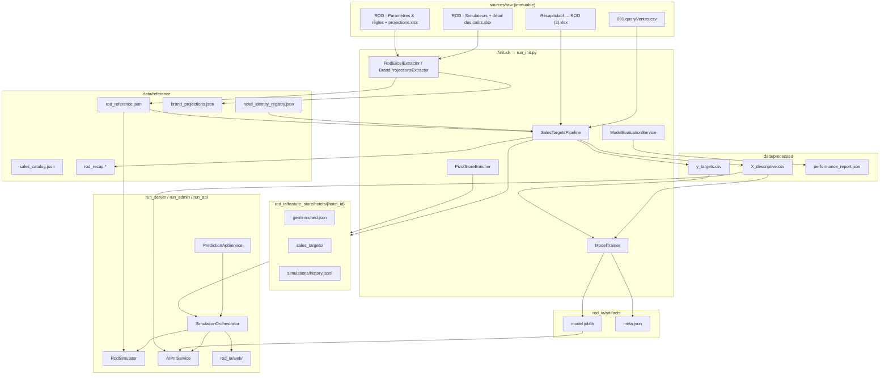
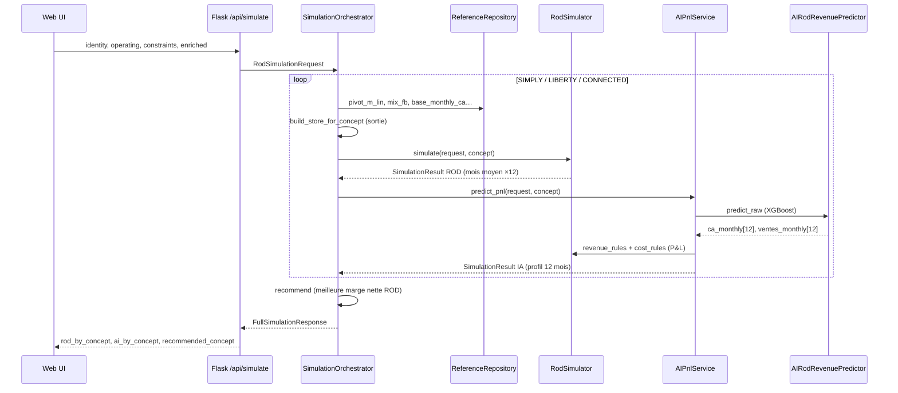

# ROD-IA — Simulateur retail Accor

Application web qui compare deux moteurs de prédiction pour le retail hôtelier Accor :

| Moteur | Nature | Granularité temporelle | Source |
|--------|--------|------------------------|--------|
| **ROD Excel** | Règles déterministes extraites des fichiers Excel ROD | **Mois moyen pilote** (plat × 12 pour l'annuel) | `data/reference/rod_reference.json` |
| **IA (XGBoost)** | Modèle ML entraîné sur l'historique ventes | **Profil mensuel** sur 12 mois distincts | `rod_ia/artifacts/model.joblib` |

Les deux passent ensuite par le même pipeline P&L (marge produit, coûts, marge nette) pour être comparables dans l'UI.

**Consignes projet** : [`docs/consignes.md`](docs/consignes.md)

---

## Démarrage rapide

| Script | Rôle |
|--------|------|
| **`./init.sh`** | Construction : extraction Excel, dataset, entraînement, évaluation, documentation code |
| **`python run_server.py`** | Interface simulateur pour les directeurs d’hôtel (port 5000) |
| **`python run_admin.py`** | Interface d’administration technique (port 5001) |
| **`python run_api.py`** | API REST de prédiction (port 5002) |
| **`./run.sh`** | Raccourci vers le simulateur utilisateur (port 5000) |
| **`python -m rod_ia.pipelines.train_model`** | Entraînement seul (`--force`, `--rebuild-dataset`) |
| **`./test.sh`** | Tests unitaires pytest |

```bash
./init.sh                 # une fois, ou après changement de données/code
python run_server.py      # simulateur → http://127.0.0.1:5000
python run_admin.py       # administration → http://127.0.0.1:5001
python run_api.py         # API REST → http://127.0.0.1:5002
```

### Interfaces web

| Public | Lancement | URL | Contenu |
|--------|-----------|-----|---------|
| Directeur d’hôtel | `run_server.py` | http://127.0.0.1:5000/ | Saisie hôtel, simulation ROD, prédictions, recommandation |
| Administration | `run_admin.py` | http://127.0.0.1:5001/ | Tableau de bord : exploration, interprétation, évaluation, doc code |
| — | `run_admin.py` | http://127.0.0.1:5001/simulator | Simulateur complet avec données brutes et évaluation |
| — | `run_admin.py` | http://127.0.0.1:5001/exploration | Parcours dataset et arbres XGBoost |
| — | `run_admin.py` | http://127.0.0.1:5001/interpretation | Importance des variables et règles |
| — | `run_admin.py` | http://127.0.0.1:5001/docs | Documentation code |
| — | `run_admin.py` | http://127.0.0.1:5001/journal | Consignes projet (`docs/consignes.md`) |

### API REST

Serveur autonome, sans interface graphique. Documentation : [`docs/api_rest.md`](docs/api_rest.md).

| Méthode | Route | Description |
|---------|-------|-------------|
| POST | `/api/v1/predict` | Prédiction ventes et marges par concept + recommandation |
| GET | `/api/v1` | Informations sur l’API |
| GET | `/health` | Contrôle de disponibilité |

---

## Vue d'ensemble : comment les éléments interagissent



### Flux d'une simulation utilisateur (`POST /api/simulate`)



**Point clé** : l'utilisateur saisit l'identité hôtel, les paramètres opérationnels (chambres, TO, guests) et des contraintes (mix, catégories exclues). La **config store** (concept, mètres linéaires, mix F&B) est **calculée en sortie** par l'orchestrateur à partir des références Excel — ce n'est pas une entrée directe.

---

## Modèle IA — détail complet

### Algorithme

| Propriété | Valeur |
|-----------|--------|
| **Wrapper** | `sklearn.multioutput.MultiOutputRegressor` |
| **Estimateur de base** | `xgboost.XGBRegressor` |
| **Fichier persistant** | `rod_ia/artifacts/model.joblib` |
| **Métadonnées** | `rod_ia/artifacts/meta.json`, `feature_cols.json`, `target_cols.json` |
| **Code d'entraînement** | `rod_ia/domain/services/model_trainer.py` — `ModelTrainer.train()` / `ensure_trained()` |
| **Pipeline autonome** | `rod_ia/pipelines/train_model.py` |

### Hyperparamètres XGBoost (`model_trainer.py`)

| Paramètre | Valeur | Rôle |
|-----------|--------|------|
| `n_estimators` | **120** | Nombre d'arbres |
| `max_depth` | **4** | Profondeur max des arbres |
| `learning_rate` | **0.08** | Taux d'apprentissage |
| `subsample` | **0.9** | Fraction d'échantillons par arbre |
| `colsample_bytree` | **0.9** | Fraction de features par arbre |
| `random_state` | **42** | Reproductibilité |

### Données d'entraînement

| Élément | Détail |
|---------|--------|
| **Hôtels** | Hôtels pivots du registre identité ayant des ventes historiques |
| **Période train** | Années **&lt; 2026** (`evaluation_year` holdout dans `dataset_meta.json`) |
| **Features (X)** | 199 colonnes `d_*` dans `data/processed/X_descriptive.csv` |
| **Targets (Y)** | 24 colonnes globales `t_m{01..12}_ca_total` et `t_m{01..12}_ventes_total` |
| **Targets détaillées** | 328 colonnes au total (par TYPE/GAMME) — non utilisées directement par le modèle actuel |

Le modèle prédit **24 sorties** (CA et ventes totales par mois). Les targets détaillées par gamme servent à construire le dataset mais le `ModelTrainer` n'entraîne que sur les targets globales mensuelles.

### Relance de l'entraînement

Le projet **ne consomme pas** un `model.joblib` figé sans le recréer : le code d'apprentissage est versionné, l'artefact est produit localement.

| Situation | Commande |
|-----------|----------|
| Première installation | `./init.sh` |
| Dataset OK, modèle supprimé | `./run.sh` (auto) ou `python -m rod_ia.pipelines.train_model` |
| Forcer un ré-entraînement | `python -m rod_ia.pipelines.train_model --force` |
| Reconstruire X/Y puis entraîner | `python -m rod_ia.pipelines.train_model --rebuild-dataset` |

Au démarrage de l'API (`build_container`), si `dataset_meta.json` existe mais pas `model.joblib`, l'entraînement est déclenché automatiquement.

### Composition des features `d_*`

| Famille | Préfixe / exemple | Origine |
|---------|-------------------|---------|
| Répartitions ventes | `d_pct_mois_m03_type_fandb_gamme_food_salee` | Moyennes historiques CSV ventes (train &lt; 2026) |
| Récap ROD | `d_recap_1_informations_generales_donnees_chiffrees_to_annuel_r25` | Excel Récapitulatif, imputé + sélectionné |
| Dérivées | `d_clients_mois`, `d_taux_acheteur` | Calculées depuis opérationnel + ventes |
| Enrichissement live | `d_nearest_beach_m`, POI, météo | `EnrichHotelService` (à la simulation) |
| Saisie utilisateur | `d_nb_chambres`, `d_taux_occupation`, `d_fb_share`… | Converties depuis la requête UI |

### Inférence (`AIRodRevenuePredictor`)

1. Construit un vecteur `d_*` depuis la requête (opérationnel + store + enrichissement).
2. Si `hotel_id` connu : fusionne les features entraînées depuis `X_descriptive.csv` via `HotelFeatureLoader`.
3. Appelle `model.predict()` → 24 valeurs.
4. Agrège en `ca_monthly[12]` et `ventes_monthly[12]`.
5. `AIPnlService` enchaîne : ventes → % → CA → marge produit (coef Excel) → coûts → marge nette.

### Interprétation

Page `/interpretation` (administration, port 5001) et API `POST /api/model-interpretation` via `ModelInterpretationService` :
- Importance globale XGBoost (moyenne des `feature_importances_` sur les 24 estimateurs)
- Importance pour l'hôtel (importance × écart à la moyenne train)
- Règles globales (sélection, imputation, entraînement)
- Règles hôtel (imputations récap, traces revenus/coûts P&L)

---

## Sources de données

### `sources/raw/` — fichiers bruts (non versionnés, immuables)

| Fichier | Rôle dans le projet |
|---------|---------------------|
| `001.queryVentes.csv` | Ventes réelles par hôtel/mois/TYPE/GAMME — **base IA** (train &lt; 2026 + test/évaluation 2026) |
| `ROD - Simulateurs + détail des coûts.xlsx` | Cellules feuilles `SIMULATEUR *` et `COUTS *` → `rod_reference.json` |
| `ROD - Paramètres & règles + projections nb. d'hôtels.xlsx` | Marques, nb hôtels, règles reco concept → `brand_projections.json` |
| `Récapitulatif de l'ensemble des données ROD (2).xlsx` | Variables hôtel `d_recap_*` → pipeline imputation/sélection |
| `2026.02.Fevrier-ExportAccor.xlsx` | Référence export Accor (non consommé directement par le pipeline actif) |
| `Analyse du poids des catégories de produit (2024-2025).xlsm` | Analyse catégories (référence métier) |

### `data/reference/` — données extraites et référentiels

| Fichier | Producteur | Consommateur(s) |
|---------|------------|-----------------|
| `hotel_identity_registry.json` | Manuel / init | **Clé de jointure** `hotel_id` pour tout le projet |
| `rod_reference.json` | `RodExcelExtractor` | `RodSimulator`, `RodRevenueRules`, `RodCostRules`, UI |
| `rod_reference_demo.json` | Fallback | Utilisé si `rod_reference.json` absent |
| `brand_projections.json` | `BrandProjectionsExtractor` | UI onglet marques, règles reco |
| `sales_catalog.json` | `SalesCatalogService` | UI sliders TYPE/GAMME |
| `rod_recap.{wide,long,schema}.json` | `RodRecapExtractor` | `FeatureImputer`, audit |
| `recomputed_sales_reference.json` | `scripts/recompute_sales_references.py` | Référence ventes recalculées |

### `data/processed/` — datasets ML et rapports

| Fichier | Contenu |
|---------|---------|
| `X_descriptive.csv` | Matrice features `d_*` (1 ligne / hôtel train) |
| `y_targets.csv` | Matrice targets `t_*` |
| `ml_dataset_full.csv` | X + Y fusionnés |
| `dataset_meta.json` | Liste colonnes, années train/val, stats sélection |
| `column_manifest.json` | Manifeste des colonnes ML |
| `train_monthly_avg_long.csv` | Moyennes mensuelles historiques (train) |
| `train_percentages_long.csv` | Répartitions % 3 niveaux (mois → TYPE → GAMME) |
| `evaluation_actuals_annual.csv` | CA réel holdout test/évaluation (2026, règle de 3) |
| `imputation_report.json` | Trace de chaque imputation récap par hôtel/colonne |
| `feature_selection_report.json` | Colonnes retirées (variance nulle, doublons) |
| `performance_report.json` | Comparaison ROD vs IA sur pivots (2026 partiel) |

### `rod_ia/artifacts/` — modèle entraîné

| Fichier | Contenu |
|---------|---------|
| `model.joblib` | `MultiOutputRegressor(XGBRegressor)` sérialisé |
| `meta.json` | n_hotels, n_features, n_targets, train_mae |
| `feature_cols.json` | Ordre des colonnes X à l'inférence |
| `target_cols.json` | Ordre des 24 targets prédites |

### `rod_ia/feature_store/hotels/{hotel_id}/` — données par hôtel

| Chemin | Contenu |
|--------|---------|
| `meta.json` | Horodatage, flags enrichissement |
| `geo/enriched.json` | POI (plage, gare…), météo mensuelle, coordonnées |
| `recap/features.json` | Features récap extraites pour cet hôtel |
| `sales_targets/monthly_avg.json` | Targets moyennes mensuelles (feature store) |
| `sales_targets/monthly_pct.json` | Répartitions % par mois |
| `rod_reference/concepts.json` | Paramètres ROD par concept pour cet hôtel |
| `simulations/history.jsonl` | Historique des simulations ROD sauvegardées |

---

## Arborescence du projet

```text
hotels/
├── init.sh                 # Pipeline construction (venv, run_init, doc, smoke test)
├── run.sh                  # Raccourci simulateur utilisateur
├── run_server.py           # Interface simulateur (directeurs d'hôtel)
├── run_admin.py            # Interface administration technique
├── run_api.py              # API REST de prédiction
├── test.sh                 # pytest
├── requirements.txt        # Dépendances (Flask, pandas, xgboost, scikit-learn…)
├── pyproject.toml
│
├── sources/raw/            # Données brutes Excel + CSV (voir section Sources)
│
├── data/
│   ├── reference/          # JSON/CSV extraits, registre identité
│   └── processed/          # Datasets ML, rapports imputation/sélection/performance
│
├── rod_ia/                 # Code applicatif principal
│   ├── config/             # Settings (chemins, URLs géo/météo)
│   ├── domain/             # Logique métier
│   ├── pipelines/          # Orchestration init
│   ├── api/                # Couche HTTP Flask
│   ├── web/                # Interface utilisateur
│   ├── artifacts/          # Modèle ML entraîné
│   └── feature_store/      # Données par hôtel
│
├── scripts/                # Utilitaires (doc, extraction règles Excel)
├── tests/                  # Tests unitaires pytest
├── docs/                   # Consignes, API REST, règles ROD, guide exploration
└── old/                    # Brouillons historiques — NE PAS utiliser pour l'IA
```

---

## `rod_ia/` — composants détaillés

### `rod_ia/config/`

| Fichier | Rôle |
|---------|------|
| `settings.py` | Chemins absolus (`sources/raw`, `data/`, `artifacts/`, `feature_store/`), constantes POI (rayons 0.1–0.5 km), URLs Nominatim/Overpass, année test/évaluation (`evaluation_year`) |

### `rod_ia/domain/models/` — structures de données

| Fichier | Rôle |
|---------|------|
| `identity.py` | `HotelRecord`, `GeoCoordinates` — registre identité |
| `hotel.py` | `HotelIdentity`, `HotelOperatingState` — entrées simulation |
| `store.py` | `StoreConfiguration`, `CategoryMix` — config retail **en sortie** |
| `simulation.py` | `RodSimulationRequest`, `SimulationResult`, `FullSimulationResponse`, `PerformanceReport` |
| `enrichment.py` | `EnrichedHotelFeatures` — POI, météo, plage |

### `rod_ia/domain/rules/` — règles métier traçables Excel

| Fichier | Rôle | Feuilles Excel source |
|---------|------|----------------------|
| `revenue_rules.py` | CA HT, ventes, clients/mois (Règle 1 : C21), impact TO, marge produit | `SIMULATEUR *` |
| `cost_rules.py` | Technos, annexes, agencement amorti 84 mois, capex | `COUTS *` |
| `recommendation_rules.py` | Filtre concepts selon nb chambres, recommande meilleure marge | `REGLES POUR RECO DU CONCEPT` |
| `traceability.py` | `RuleTrace` — lien règle Python ↔ cellule Excel |

Chaque règle produit une `trace` (rule_id, workbook, sheet, cells, description) visible dans les résultats et la page d'interprétation.

### `rod_ia/domain/repositories/` — accès données

| Fichier | Rôle |
|---------|------|
| `identity_registry.py` | Lecture/écriture `hotel_identity_registry.json`, résolution `hotel_id` |
| `reference_repository.py` | Accès clé-valeur à `rod_reference.json` (`concepts.SIMPLY.base_monthly_ca_fb`…) |
| `feature_store_repository.py` | Persistance JSON par hôtel (enrichissement, targets, historique simulations) |

### `rod_ia/domain/services/` — logique applicative

#### Extraction et préparation données

| Service | Rôle | Entrée → Sortie |
|---------|------|-----------------|
| `rod_excel_extractor.py` | Extrait cellules Excel ROD | `.xlsx` → `rod_reference.json` |
| `rod_excel_extractor.py` (`BrandProjectionsExtractor`) | Stats marques / nb hôtels | `.xlsx` → `brand_projections.json` |
| `rod_recap_extractor.py` | Parse feuille RECAP DATA ROD | `.xlsx` → `rod_recap.*` |
| `sales_catalog_service.py` | Catalogue TYPE/GAMME depuis CSV ventes | CSV → `sales_catalog.json` |
| `sales_targets_pipeline.py` | **Pipeline IA centrale** : moyennes mensuelles, %, dataset ML | CSV + registre → `data/processed/` |
| `feature_imputer.py` | Impute trous récap (bool→0, TO pilote, médiane…) | → `imputation_report.json` |
| `feature_selector.py` | Retire colonnes constantes / doublons | → `feature_selection_report.json` |
| `pivot_store_enricher.py` | Remplit feature store pour chaque hôtel pivot | → `feature_store/hotels/` |
| `ml_column_naming.py` | Convention `d_*` / `t_*`, garde-fou anti-fuite targets | — |

#### Modèle et évaluation

| Service | Rôle |
|---------|------|
| `model_trainer.py` | Entraîne XGBoost, persiste `model.joblib` + meta |
| `ai_predictor.py` | Charge modèle, `request_to_features()`, `predict_raw()` |
| `hotel_feature_loader.py` | Charge ligne `d_*` d'un hôtel depuis `X_descriptive.csv` |
| `model_evaluation_service.py` | Compare ROD vs IA sur 2026 (mois présents, règle de 3) |
| `model_interpretation_service.py` | Importance features, config modèle, règles globales/hôtel |

#### Simulation

| Service | Rôle |
|---------|------|
| `rod_simulator.py` | Simulation ROD déterministe (revenus + coûts, mois moyen ×12) |
| `ai_pnl_service.py` | Pipeline IA 6 étapes : prédiction → % → CA → marge → coûts → marge nette |
| `simulation_orchestrator.py` | Orchestre 3 concepts, construit store en sortie, recommande |
| `optimizer.py` | Optimisation sous contraintes (m_lin, mix F&B) |
| `enrich_hotel.py` | Géocodage, POI Overpass, météo Meteostat, distance plage |
| `prediction_api_service.py` | API REST : enrichissement, simulation, réponse structurée |

#### Utilitaires ventes

| Service | Rôle |
|---------|------|
| `sales_mix_extractor.py` | Extraction mix ventes |
| `sales_percentage_service.py` | Calcul répartitions % |
| `ml_dataset_builder.py` | Construction dataset (délègue à pipeline) |

### `rod_ia/pipelines/`

| Fichier | Rôle |
|---------|------|
| `run_init.py` | Orchestrateur `./init.sh` : extraction → dataset → pivots → train → évaluation |
| `build_ml_dataset.py` | CLI dataset ML (wrapper `SalesTargetsPipeline`) |

### `rod_ia/api/` — couche HTTP

| Fichier | Rôle |
|---------|------|
| `app_factory.py` | Factory Flask web — modes `user` et `admin` |
| `api_factory.py` | Factory Flask API REST autonome |
| `dependencies.py` | `AppContainer` — injection des dépendances |
| `routes/simulate.py` | `POST /api/simulate`, `POST /api/optimize` |
| `routes/prediction.py` | `POST /api/v1/predict` |
| `routes/enrich.py` | `POST /api/enrich` — POI + météo |
| `routes/performance.py` | `GET /api/performance` (admin) |
| `routes/catalog.py` | `GET /api/sales-catalog` |
| `routes/interpretation.py` | `POST /api/model-interpretation` (admin) |
| `routes/exploration.py` | Exploration données et modèle (admin) |
| `routes/hotel.py` | Endpoints hôtel |
| `routes/health.py` | `GET /health` |

### `rod_ia/web/` — interface utilisateur

| Fichier | Rôle |
|---------|------|
| `index.html` | Simulateur utilisateur (parcours en 5 étapes) |
| `admin.html` | Accueil administration |
| `admin-simulator.html` | Simulateur complet avec évaluation et données brutes |
| `script.js` | Logique simulateur : saisie, simulation, graphiques |
| `style.css` | Styles |
| `exploration.html` | Exploration dataset et arbres XGBoost (admin) |
| `exploration.js` | Tableaux données, visualisation arbre |
| `interpretation.html` | Interprétation du modèle (admin) |
| `interpretation.js` | Importance des variables, règles |
| `docs/index.html` | Documentation code (produite par `init.sh`) |

**Parcours simulateur utilisateur** (`index.html`) :

1. Informations générales — identité hôtel, chambres, TO
2. Services et équipements — F&B, lobby
3. Profil clients — répartition, besoins
4. Boutique / corner — corner existant
5. Simulation de revenu — assortiment, résultats ROD, prédictions, recommandation

L’exploration, l’interprétation et l’évaluation ne sont pas accessibles depuis l’interface utilisateur.

---

## Pipeline `./init.sh` — étapes

1. Crée/active `.venv`, installe `requirements.txt`
2. `RodExcelExtractor` → `rod_reference.json`
3. `BrandProjectionsExtractor` → `brand_projections.json`
4. `SalesCatalogService` → `sales_catalog.json`
5. `SalesTargetsPipeline.build_training_dataset()` → `X_descriptive.csv`, `y_targets.csv`, rapports
6. `PivotStoreEnricher.enrich_all_pivots()` → `feature_store/hotels/`
7. `ModelTrainer.ensure_trained(force=True)` → `artifacts/model.joblib` (sauf `--skip-train`)
8. `ModelEvaluationService.evaluate()` → `performance_report.json`
9. `scripts/generate_code_docs.py` → `web/docs/index.html`
10. Smoke test API (`/health`, `/api/simulate`)

---

## Principes métier

1. **Excel ROD** = source de vérité simulateur (feuille SIMULATEUR * = mois moyen, annuel = × 12)
2. **Config store** = sortie proposée par concept, pas une entrée utilisateur
3. **Jointures** uniquement via `hotel_id` (`hotel_identity_registry.json`)
4. **IA train** : historique ventes &lt; 2026 → moyennes mensuelles + répartitions % (3 niveaux)
5. **IA test/évaluation** : CA réel 2026 (holdout) sur mois présents ; prédictions ramenées à la période ; annualisation règle de 3
6. **ROD par hôtel** : scaling Règle 1 — `clients/mois = chambres × TO × guests × 30.5`
7. **ML** : `d_*` (features) / `t_*` (targets) ; modèle prédit 24 targets globales mensuelles
8. **Récap ROD** : `d_recap_*` imputées puis sélectionnées (variance nulle / doublons retirés)

### Imputation récap (`feature_imputer.py`)

| Type | Stratégie |
|------|-----------|
| Booléen (BAR, SPA, corner…) | `0` |
| TO / guests | Pilote marque |
| Nb chambres | Registre identité |
| Panier moyen | CA train / ventes train |
| Taux acheteur | Ventes / clients hébergés (C21) |
| Autres numériques | Médiane globale |
| Texte | Exclu de X |

---

## API HTTP

### Simulateur web (`run_server.py`, port 5000)

| Méthode | Route | Description |
|---------|-------|-------------|
| GET | `/health` | Disponibilité |
| POST | `/api/simulate` | 3 concepts ROD + prédictions + recommandation |
| POST | `/api/optimize` | Optimisation sous contraintes |
| POST | `/api/enrich` | POI + météo → feature store |
| GET | `/api/brands` | Statistiques marques |
| GET | `/api/sales-catalog` | Catégories TYPE / GAMME |
| GET | `/api/param-wiring` | Registre des champs branchés sur les moteurs |

### Administration (`run_admin.py`, port 5001)

Routes du simulateur ci-dessus, plus :

| Méthode | Route | Description |
|---------|-------|-------------|
| GET | `/api/performance` | Évaluation ROD vs modèle |
| POST | `/api/model-interpretation` | Interprétation du modèle |
| GET | `/api/model/status` | État dataset et modèle |
| POST | `/api/model/train` | Réentraînement (`{"force": true}` optionnel) |
| GET | `/api/data-exploration` | Échantillons pipeline dataset |
| GET | `/api/model-exploration/meta` | Métadonnées modèle |
| GET | `/api/model-exploration/tree` | Structure d’un arbre XGBoost |
| POST | `/api/model-exploration/predict` | Prédiction avec surcharge de variables |

### API REST (`run_api.py`, port 5002)

| Méthode | Route | Description |
|---------|-------|-------------|
| GET | `/health` | Disponibilité |
| GET | `/api/v1` | Informations API |
| POST | `/api/v1/predict` | Prédiction complète (entrée renvoyée + contexte + 3 concepts + recommandation) |

Détail des champs et exemples : [`docs/api_rest.md`](docs/api_rest.md).

---

## Affichage CA (cohérence UI)

| Source | Mois moyen | Annuel |
|--------|------------|--------|
| ROD | `ca_mensuel_moyen` (plat sur graphique) | `ca_mensuel_moyen × 12` |
| IA | Profil 12 mois / moyenne | `Σ monthly.ca` |

---

## `scripts/` et `tests/`

### Scripts

| Script | Rôle |
|--------|------|
| `generate_code_docs.py` | Génère `rod_ia/web/docs/index.html` depuis les docstrings |
| `extract_excel_rules.py` | Extraction règles Excel (audit) |
| `recompute_sales_references.py` | Recalcule références ventes |

### Tests (`./test.sh`)

| Fichier | Couverture |
|---------|------------|
| `test_simulation.py` | Orchestration, 3 concepts, pipeline |
| `test_enrich_hotel.py` | Enrichissement POI/météo |
| `test_recap_features.py` | Features récap ML |
| `test_identity_registry.py` | Registre identité |
| `test_ml_column_naming.py` | Convention colonnes |
| `test_sales_catalog.py` | Catalogue ventes |
| `test_sales_percentages.py` | Répartitions % |
| `test_beach_distance.py` | Distance plage |
| `test_operating_state.py` | État opérationnel hôtel |
| `test_prediction_api.py` | API REST de prédiction |
| `test_exploration_api.py` | API exploration données et modèle |

---

## Fichiers `.gitignore` (non versionnés)

- `.venv/` — environnement Python (recréé par `init.sh`)
- `sources/raw/` — fichiers Excel/CSV volumineux
- `__pycache__/`, `.pytest_cache/`
- `rod_ia/artifacts/*.joblib` — modèles ML (recréés par init)

---

## Documentation complémentaire

| Document | Contenu |
|----------|---------|
| [`docs/consignes.md`](docs/consignes.md) | Consignes métier et état d’implémentation |
| [`docs/api_rest.md`](docs/api_rest.md) | API REST de prédiction |
| [`docs/rod_rules.md`](docs/rod_rules.md) | Règles simulateur ROD et évaluation |
| [`docs/exploration_interface.md`](docs/exploration_interface.md) | Guide page Exploration |
| `rod_ia/web/docs/index.html` | Documentation code (produite par `init.sh`) |

Le code actif est sous `rod_ia/`. Le répertoire `old/` n’est pas utilisé.