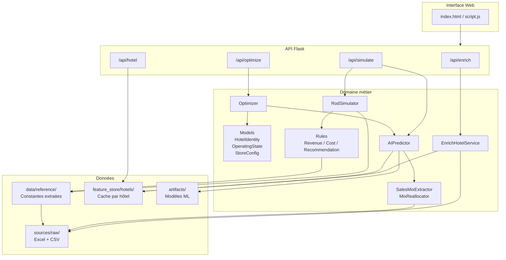

# Analyse complète du projet ROD-IA — Architecture cible, feature store et plan de refactorisation

> **Date :** 2026-07-01  
> **Auteur :** analyse automatisée du dépôt `hotels`  
> **Objectif :** document de validation avant toute implémentation concrète  
> **Statut :** à valider par le client / product owner

---

## 0. Résumé exécutif

Le dépôt contient aujourd'hui **trois couches distinctes** :

| Couche | Emplacement | Maturité |
|--------|-------------|----------|
| **Documentation & sources brutes** | `docs/`, `sources/raw/` | Mature — bien structurée |
| **Prototype monolithique v1** | `old/` (racine) | Démo fonctionnelle — non conforme Excel |
| **Refactorisation architecturale v2** | `old/rod_ia_refactor_project/` | Structure correcte — références à zéro, non branchée |

**Constat principal :** le *quoi* est bien documenté, le *comment* legacy existe en démo, mais **aucune implémentation propre n'est encore à la racine du dépôt**. La prochaine étape n'est pas d'ajouter du ML : c'est de **stabiliser la vérité fonctionnelle** (Excel → Python fidèle → feature store → targets correctes → puis IA).

**Trajectoire recommandée :**

```text
Excel ROD fidèle
  → feature store par hôtel
  → targets = moyenne mensuelle historique (pas somme)
  → XGBoost V1 (leave-one-hotel-out)
  → stacking OOF
  → optimisation sous contraintes
  → web app propre (ROD vs IA vs optimiseur)
```

---

## 1. État actuel du dépôt

### 1.1. Arborescence active (hors `old/`)

```text
hotels/
├── docs/                          # 5 fichiers de documentation
│   ├── consigne ROD.odt           # Spec fonctionnelle (#2)
│   ├── documentation_fonctionnelle_audit_ROD_v2.md
│   ├── documentation_fonctionnelle_audit_ROD_v2 (1).md  # doublon
│   ├── documentation_technique_rod_complete.md
│   ├── documentation_zip_architecture_rod_ia.md
│   └── analyse_architecture_cible_rod_ia.md  # ce document
├── sources/raw/                   # 6 fichiers sources canoniques
│   ├── 001.queryVentes.csv
│   ├── 2026.02.Fevrier-ExportAccor.xlsx
│   ├── ROD - Simulateurs + détail des coûts.xlsx
│   ├── ROD - Paramètres & règles + projections nb. d'hôtels.xlsx
│   ├── Récapitulatif de l'ensemble des données ROD (2).xlsx
│   └── Analyse du poids des catégories de produit (2024-2025).xlsm
├── grok.sh, gitpush.sh
└── old/                           # TOUT le code, notebooks, artefacts ML, brouillons
```

**Remarque :** pas de `src/`, `app/`, `requirements.txt`, ni README projet à la racine. Le dépôt actif = docs + sources ; l'implémentation = `old/`.

### 1.2. Contenu de `old/` — trois générations

```text
old/
├── [v1 — prototype monolithique]
│   ├── server.py, business_logic.py, rod_simulator.py, rod_full_simulator.py
│   ├── rod_rules.py, enrich_hotel.py, hotel_ca_projector.py, simulateur_corner.py
│   ├── prepare_ml_dataset.py, prepare_X_y_clean.py, ml_xgboost_baseline.py
│   ├── 16 notebooks Jupyter (ETL, ML, association rules)
│   ├── web/ (index.html, script.js, style.css)
│   ├── artifacts/ (model.joblib, scaler, feature_cols, target_cols, meta.json)
│   └── ~30 fichiers CSV/XLSX préparés
│
├── small/                         # Copies Excel + mockup UI (source de vérité locale)
│   ├── ROD - Simulateurs + détail des coûts.xlsx
│   ├── ROD - Paramètres & règles + projections nb. d'hôtels.xlsx
│   ├── Analyse du poids des catégories (2024-2025).xlsm
│   ├── 2026.02.Fevrier-ExportAccor.xlsx
│   └── Simulation-IA-ROD.png        # maquette visuelle cible
│
└── rod_ia_refactor_project/       # [v2 — architecture cible, scaffold]
    ├── app/domain/{models,rules,services,repositories}
    ├── app/routes/, app/web/, app/feature_store/
    ├── scripts/ (extract_excel_rules, recompute_sales_references)
    ├── docs/audit/ (CSV d'audit, décisions keep/modify/drop)
    └── legacy_original/ (copie byte-identique de v1)
```

---

## 2. Hiérarchie des sources de vérité

Cette hiérarchie est **non négociable** pour le refactor :

| Priorité | Source | Rôle |
|----------|--------|------|
| **#1** | Classeurs Excel ROD (`sources/raw/`) | Règles, coûts, revenus, marges, amortissement, recommandation concept |
| **#2** | `consigne ROD.odt` | Stratégie produit, feature store, ML, contraintes, stacking |
| **#3** | `001.queryVentes.csv` + exports | Vérité observationnelle (ventes réelles) |
| **#4** | Notebooks / scripts legacy | Matériau d'audit — **pas** vérité métier |

**Règle d'or :** aucune constante métier inventée en Python. Toute valeur vient de l'Excel, d'un recalcul depuis les ventes pivots, ou d'une hypothèse **explicitement documentée et validée**.

---

## 3. Domaine métier — concepts clés

### 3.1. Les trois concepts retail Accor

| Concept | Description | Ordre de coût |
|---------|-------------|---------------|
| **SIMPLY STORE** | Caisse opérateur/réception, scanner possible, pas d'auto-service complet | Le plus bas |
| **LIBERTY STORE** | Self-service, vitrine sèche, borne/caisse | Moyen |
| **CONNECTED STORE** | Self-service + frigo/connecté | Le plus haut |

### 3.2. Hôtels pivots

**7 hôtels** dans le récapitulatif ROD (`sources/raw/Récapitulatif...xlsx`) :

| Marque | Hôtel | Ville | Chambres |
|--------|-------|-------|----------|
| IBIS BUDGET | Nice Californie | Nice | 129 |
| IBIS BUDGET | Strasbourg République | Strasbourg | 97 |
| IBIS STYLES | Roissy CDG | Roissy | 309 |
| NOVOTEL | Megève Mont Blanc | Megève | 572 |
| NOVOTEL | Paris Centre Tour Eiffel | Paris | 764 |
| MERCURE | Montmartre Sacré-Cœur | Paris | 305 |
| MERCURE | Paris Boulogne | Boulogne | 191 |

**5 hôtels** avec transactions dans `001.queryVentes.csv` (ML training set actuel) :

- Ibis budget Nice (129 ch)
- Ibis budget Strasbourg Centre République (97 ch)
- Mercure Paris Montmartre Sacré-Cœur (305 ch)
- Novotel Megève Mont-Blanc (572 ch)
- Novotel Paris Tour Eiffel (764 ch)

**Incohérence à trancher :** Roissy CDG et Boulogne sont dans le récap ROD mais absents des ventes CSV. Novotel Porte d'Italie apparaît dans certains exports Feb 2026 mais pas dans le ML training set actuel (5 pivots). Le nombre exact d'hôtels pivots ML vs ROD doit être figé avant codage.

### 3.2.1. Vigilance sur les jointures — noms d'hôtel et géolocalisation

**Ne jamais joindre sur le nom brut.** Les libellés diffèrent selon la source :

| Source | Champ | Exemple |
|--------|-------|---------|
| Ventes CSV | `NOM BOUTIQUE` | `Ibis budget Nice` |
| Ventes CSV | | `Ibis budget Strasbourg Centre République` |
| Ventes CSV | | `Novotel Paris Tour Eiffel` |
| Récap ROD (colonnes) | nom commercial Accor | `Nice Californie`, `Strasbourg République`, `Paris Centre Tour Eiffel` |
| ML artifacts (`meta.json`) | `HOTEL_NAME` | `Ibis budget Nice` (5 pivots) |
| Exports Accor ponctuels | variantes | `Ibis Budget Strasbourg` (sans « Centre République ») |
| Géocodage Nominatim | adresse résolue | peut différer du nom saisi |

**Écarts observés (à mapper explicitement) :**

| `hotel_id` canonique (proposé) | Ventes (`NOM BOUTIQUE`) | ROD récap (colonne) | Ville |
|-------------------------------|-------------------------|---------------------|-------|
| `ibis-budget-nice` | Ibis budget Nice | Nice Californie | Nice |
| `ibis-budget-strasbourg` | Ibis budget Strasbourg Centre République | Strasbourg République | Strasbourg |
| `ibis-styles-roissy-cdg` | — (pas de ventes) | Roissy CDG | Roissy |
| `novotel-megeve` | Novotel Megève Mont-Blanc | Megève Mont Blanc | Megève |
| `novotel-paris-tour-eiffel` | Novotel Paris Tour Eiffel | Paris Centre Tour Eiffel | Paris |
| `mercure-montmartre` | Mercure Paris Montmartre Sacré-Cœur | Montmartre Sacré-Cœur | Paris |
| `mercure-boulogne` | — (pas de ventes) | Paris Boulogne | Boulogne |
| `novotel-porte-italie` | Novotel Porte d'Italie | — (hors récap 7 pivots) | — |

**Règle architecturale :** toute jointure passe par un **référentiel d'identité** (`data/reference/hotel_identity_registry.json` ou table parquet), jamais par égalité de chaîne entre sources.

```text
Chaque source expose son libellé brut
  → normalisation (unicode, casse, accents, tirets)
  → lookup dans hotel_identity_registry
  → hotel_id canonique (clé unique)
  → jointures uniquement sur hotel_id (+ lat/lon arrondis si géo)
```

**Géolocalisation — vigilance complémentaire :**

- Le géocodage dépend du couple `(nom, ville, adresse)` : deux saisies différentes → deux `(lat, lon)` possibles.
- POI et météo sont indexés par `(lat, lon)` arrondis (ex. 5 décimales) — pas par nom.
- Un hôtel pivot peut avoir des coordonnées ROD (récap) **et** des coordonnées Nominatim (enrichissement) : il faut stocker les deux avec leur source et définir la **coordonnée canonique** (priorité : adresse ROD validée > géocodage confirmé manuellement > Nominatim auto).
- Tolérance de rapprochement géographique : si deux sources donnent des points à < 200 m, fusionner ; sinon **alerter** (pas de merge silencieux).

```python
# Jointure INTERDITE
df.merge(rod, on="HOTEL_NAME")          # faux positifs garantis
df.merge(sales, left_on="NOM BOUTIQUE", right_on="hotel_name")

# Jointure CORRECTE
df.merge(registry, on="hotel_id")
registry.resolve("NOM BOUTIQUE", raw_name) → hotel_id
```

Le legacy (`prepare_ml_dataset.py`, `merge_data.ipynb`) joint souvent sur `HOTEL_NAME` après renommage manuel de `NOM BOUTIQUE` — **c'est une dette P0 à corriger**.

### 3.3. Variables métier centrales

| Variable | Description | Où elle vit |
|----------|-------------|-------------|
| `m_lin` | Mètres linéaires d'espace retail | Saisie directeur, impact CA |
| `TO` | Taux d'occupation | Saisie / projection, impact funnel |
| `guests/chambre` | Clients hébergés par chambre occupée | Funnel clients |
| `mix F&B / N-F&B` | Répartition catégories | Contraintes utilisateur |
| `taux acheteurs` | Ventes / clients hébergés mois | Règle 1 Excel (depuis ventes pivots) |
| `CA HT F&B / N-F&B` | Chiffre d'affaires par type | Simulateur revenus |
| `marge nette` | Marge produit − coûts mensuels | P&L |
| `amortissement` | Capex / marge nette (mois) | ROI |

### 3.4. Funnel de calcul ROD (Excel)

```text
Chambres occupées     = nb_chambres × TO
Clients hébergés/jour = nb_chambres × TO × guests/chambre
Clients hébergés/mois = clients/jour × 30.5
Taux acheteurs        = nb_ventes_ref / clients_mois_ref  (recalculé depuis ventes pivots)
Nb ventes projetées   = clients_mois × taux_acheteurs × facteur_m_lin × facteur_mix × facteur_TO
CA                    = nb_ventes × panier_moyen (par type F&B / N-F&B)
Marge nette           = marge_produit − coûts_mensuels (technos + annexes + agencement)
```

### 3.5. Règles de recommandation concept (Excel `REGLES POUR RECO DU CONCEPT`)

1. Chambres : Simply 0–49, Liberty/Connected > 50
2. Catégories N-F&B (Cosmétique, Enfants, Prêt-à-porter, Accessoires, Souvenirs)
3. Mètres linéaires > 4 → Liberty
4. Vitrine réfrigérée existante
5. TO YTD < 70 % comme filtre final

### 3.6. Pipeline ventes → répartitions en % → targets ML

**Point de départ :** `001.queryVentes.csv` (ou `data.csv` nettoyé), jointure via `hotel_id` (pas `NOM BOUTIQUE` brut).

#### Étape 1 — Agrégats absolus (moyenne mensuelle historique)

Pour chaque `hotel_id × mois calendaire (01–12) × TYPE × GAMME` :

- `avg_montant` = moyenne du CA mensuel sur les années disponibles (hors 2026 pour le train)
- `avg_nbr_ventes` = moyenne du nombre de tickets mensuels sur les années disponibles
- métadonnées : `nb_years_observed`, `nb_observations`, `total_tickets_count`

> **Pas** la somme des années — la **moyenne** par mois saisonnier, quelle que soit la durée d'historique par hôtel.

#### Étape 2 — Répartitions en pourcentage (depuis les ventes)

Construire **en cascade** à partir des moyennes absolues :

```text
Niveau 1 — saisonnalité globale (par hôtel)
  pct_mois_m{MM} = avg_CA_mois_M / sum(avg_CA_m01..m12)
  → 12 colonnes, somme = 100 %

Niveau 2 — répartition par catégorie (TYPE) dans chaque mois
  pct_mois_m{MM}_type_{TYPE} = avg_CA(mois, TYPE) / avg_CA(mois, total)
  → ex. m07 : 70 % F&B, 30 % N-F&B

Niveau 3 — répartition par sous-catégorie (GAMME) dans chaque mois × TYPE
  pct_mois_m{MM}_type_{TYPE}_gamme_{GAMME} = avg_CA(mois, TYPE, GAMME) / avg_CA(mois, TYPE)
  → ex. m07 F&B : 40 % ALCOOL, 35 % FOOD SALÉE, …
```

Ces pourcentages sont des **features descriptives** (patterns de vente appris sur pivots) et/ou des **cibles de forme** (si on prédit la structure du mix). Ils doivent être recalculables et versionnés dans `feature_store/.../sales_targets/`.

#### Étape 3 — Convention de nommage `t_` / `d_` / informatif

**Problème identifié :** avec ~5000 colonnes, il devient difficile de distinguer targets et descriptives au moment du ML.

**Convention obligatoire à la génération du dataset :**

| Préfixe | Rôle | Exemples | Utilisé en IA ? |
|---------|------|----------|-----------------|
| `t_` | **Target** — à prédire (montant ou nb ventes) | `t_m07_fb_alcool_montant`, `t_m07_fb_alcool_nbr_ventes`, `t_ca_annuel` | Oui (y) |
| `d_` | **Descriptive** — feature d'entrée modèle | `d_nb_chambres`, `d_m_lin`, `d_poi_fb_0_3km`, `d_m04_temp_mean`, `d_pct_mois_m07` | Oui (X) |
| *(sans préfixe)* | **Informatif / liaison** — identité, traçabilité, jointures | `hotel_id`, `NOM BOUTIQUE_raw`, `rod_column_name`, `lat`, `lon`, `brand`, `source_file` | **Non** — exclu du fit ML |

```python
# Au moment du fit ML — seuls t_ et d_ entrent en jeu
X = df[[c for c in df.columns if c.startswith("d_")]]
y = df[[c for c in df.columns if c.startswith("t_")]]

# Colonnes informatives : conservées dans le dataset complet, jamais dans X/y
INFO_COLS = {"hotel_id", "hotel_name_raw", "city", "brand", "lat", "lon", "geocode_source", ...}
```

**Mapping ancien format → nouveau :**

| Ancien (legacy) | Nouveau |
|-----------------|---------|
| `m07__FB__ALCOOL__montant` | `t_m07_fb_alcool_montant` |
| `m07__FB__ALCOOL__nbr_ventes` | `t_m07_fb_alcool_nbr_ventes` |
| `etape_rod__1_...__nb_de_chambres` | `d_nb_chambres` |
| `fb_0_3km` | `d_poi_fb_0_3km` |
| `m04_temp_mean` | `d_m04_temp_mean` |
| `pct_mois_m07` | `d_pct_mois_m07` |
| `HOTEL_NAME` | `hotel_id` (+ `hotel_name_raw` informatif) |

**Règles de validation :**

1. Aucune colonne `t_*` ne doit apparaître dans `X` (test anti-fuite automatique).
2. Aucune colonne informative (`hotel_id`, noms bruts, lat/lon) ne doit apparaître dans `X` sauf si explicitement convertie en `d_*` numérique.
3. Le pipeline `build_ml_dataset.py` génère un manifeste JSON listant `{col, prefix, source, description}` pour chaque colonne.

**Granularité des targets `t_` (alignée consigne) :**

- **L1 global :** `t_m{MM}_ca_total`, `t_m{MM}_nbr_ventes_total`
- **L1 catégorie :** `t_m{MM}_{type}_montant`, `t_m{MM}_{type}_nbr_ventes`
- **L1 sous-catégorie :** `t_m{MM}_{type}_{gamme}_montant`, `t_m{MM}_{type}_{gamme}_nbr_ventes`

Les répartitions en % (`d_pct_*`) restent descriptives — elles aident le modèle à comprendre la **forme** du mix sans fuiter les montants absolus des targets.

---

## 4. Inventaire des sources de données

### 4.1. Fichiers bruts (`sources/raw/`)

| Fichier | Taille / lignes | Rôle |
|---------|-----------------|------|
| `001.queryVentes.csv` | ~85 674 lignes, 20 colonnes | Ventes historiques 2023–2026, 6 hôtels |
| `2026.02.Fevrier-ExportAccor.xlsx` | 3 492 lignes | Export test fév. 2026, association rules |
| `ROD - Simulateurs + détail des coûts.xlsx` | 8 feuilles, ~135 formules/simulateur | Moteur déterministe revenus + coûts |
| `ROD - Paramètres & règles + projections.xlsx` | 14 feuilles | Recommandation, panel, prototype UI, DATA |
| `Récapitulatif...ROD (2).xlsx` | 145×17 | Questionnaire ROD des 7 pivots |
| `Analyse du poids des catégories (2024-2025).xlsm` | ~89k lignes BASE | Poids catégories — **contient des #REF!** |

### 4.2. Fichiers préparés legacy (`old/`)

| Fichier | Rôle | Problème |
|---------|------|----------|
| `rod_prepared_data.xlsx` | ROD aplati par hôtel (~130+ cols) | Pipeline notebook, pas versionné |
| `transaction_prepared_data.xlsx` | Ventes pivotées mois/type/gamme | **Somme** au lieu de **moyenne** |
| `poi_prepared_data.xlsx` | POI 1–5 km | Rayons incorrects (spec = 0.1–0.5 km) |
| `weather_prepared_data.xlsx` | ~5000 cols météo mensuelles | Format OK mais non persisté par hôtel |
| `ml_data.xlsx` | 5 lignes × ~5400 colonnes | Dataset ML fusionné |
| `X_features_clean.csv` / `y_targets_clean.csv` | Split anti-fuite | Bon principe, mauvaise agrégation cibles |
| `artifacts/model.joblib` | XGBoost 286 sorties | Entraîné sur N=5, p≈5169 — surapprentissage |

### 4.3. Artefacts ML existants (`old/artifacts/`)

```json
// meta.json — 5 pivots ML
{
  "pivots": [
    {"HOTEL_NAME": "Ibis budget Nice", "nb_chambres": 129},
    {"HOTEL_NAME": "Ibis budget Strasbourg Centre République", "nb_chambres": 97},
    {"HOTEL_NAME": "Mercure Paris Montmartre Sacré-Cœur", "nb_chambres": 305},
    {"HOTEL_NAME": "Novotel Megève Mont-Blanc", "nb_chambres": 572},
    {"HOTEL_NAME": "Novotel Paris Tour Eiffel", "nb_chambres": 764}
  ]
}
```

Ces artefacts sont **réutilisables** après correction du pipeline de targets, pas avant.

---

## 5. Analyse du code legacy (v1 — `old/`)

### 5.1. Modules Python principaux

| Module | Lignes ~ | Rôle | Verdict |
|--------|----------|------|---------|
| `server.py` | ~470 | Flask monolithique : predict, enrich, simulate, business_simulate | **Refactorer** — mélange tout |
| `rod_simulator.py` | ~200 | Simulateur revenus déterministe | **Modifier fortement** — hardcode refs pilotes |
| `rod_full_simulator.py` | ~300 | Revenus + coûts + grid-search optimiseur | **Modifier** — coûts simplifiés |
| `rod_rules.py` | ~150 | Règles recommandation concept | **Modifier** — valider vs Excel |
| `business_logic.py` | ~250 | Funnel, reallocation mix, P&L, optimiseur | **Modifier** — buyer_rate=0.35 inventé |
| `enrich_hotel.py` | ~200 | Géocodage + POI + météo | **Modifier** — rayons 1–5 km |
| `prepare_ml_dataset.py` | ~150 | ETL ventes → wide matrix | **Modifier** — somme → moyenne |
| `prepare_X_y_clean.py` | ~80 | Anti-fuite X/y | **Garder** — bon principe |
| `ml_xgboost_baseline.py` | ~100 | Entraînement XGBoost | **Garder** — après correction targets |
| `hotel_ca_projector.py` | ~100 | Ridge regression CA pivot | **Archiver** |
| `simulateur_corner.py` | ~150 | Sim basée ventes historiques | **Archiver** |

### 5.2. API Flask v1 (`server.py`)

| Endpoint | Rôle | Problème |
|----------|------|----------|
| `GET /` | UI | OK |
| `GET /api/feature_info` | Liste colonnes ML | OK |
| `POST /api/predict` | XGBoost → 286 targets | Utilise vecteur pivot par défaut |
| `POST /api/enrich` | Géocode + POI + météo | Pas de persistance |
| `POST /api/simulate` | Corner simulation | Approche hybride obsolète |
| `POST /api/rod_simulate` | Formules ROD | Non fidèle Excel |
| `POST /api/reallocate` | What-if mix | OK conceptuellement |
| `POST /api/business_simulate` | P&L + optimiseur | Coûts simplifiés |

### 5.3. Notebooks Jupyter (16 fichiers)

| Notebook | Rôle | Verdict |
|----------|------|---------|
| `rod_data.ipynb` | Aplatissement ROD (`HotelExcelFlattener`) | **Industrialiser** → module Python |
| `transaction_data.ipynb` | Agrégation ventes mensuelles | **Corriger** (moyenne) |
| `poi.ipynb` / `weather_data.ipynb` | Enrichissement POI/météo | **Adapter** (rayons 0.1–0.5) |
| `merge_data.ipynb` | Fusion rod + transaction + poi + weather | **Refondre** via feature store |
| `ml.ipynb` / `ml_v0.ipynb` | Entraînement ML | v0 archiver, ml adapter |
| `rod_data_v0.ipynb` / `rod_selection.ipynb` | Expériences Keras/dummies | **Archiver** |
| `association_gamme/product.ipynb` | Apriori paniers | **Archiver** (hors scope V1) |
| `data_augmentation.ipynb` | Augmentation données | **Archiver** |
| `rod_sim_cout.ipynb` | Exploration coûts | **Référence** pour extraction Excel |

### 5.4. Interface web v1 (`old/web/`)

- **Stack :** HTML + Tailwind CDN + Chart.js + vanilla JS
- **UX :** 5 onglets miroir des écrans ROD (Infos générales, Services, Profil clients, Corner, POI/Météo)
- **Fonctionnel :** enrichissement auto, prédiction ML, simulation ROD
- **Problème :** champs liés aux colonnes ML brutes (`data-col="etape_rod__1_..."`) — couplage fort dataset/UI
- **Maquette cible :** `old/small/Simulation-IA-ROD.png`

**Verdict :** conserver l'UX et le flow utilisateur ; découpler le front des noms de colonnes ML.

---

## 6. Analyse du refactor v2 (`old/rod_ia_refactor_project/`)

### 6.1. Ce qui est bien conçu

| Composant | Fichier(s) | Qualité |
|-----------|-----------|---------|
| Modèles métier | `domain/models/hotel.py`, `store.py`, `simulation.py` | Dataclasses propres, `HotelOperatingState` avec setters interdépendants |
| Traçabilité règles | `domain/rules/traceability.py` → `RuleTrace` | Prêt pour mapping Excel cellule par cellule |
| Séparation couches | `models/ rules/ services/ repositories/` | Architecture DDD légère correcte |
| Configuration | `config/settings.py` | POI 0.1–0.5 km, chemins centralisés |
| Routes Flask | `routes/enrich.py`, `simulate.py` | Blueprints séparés |
| Scripts extraction | `scripts/extract_excel_rules.py`, `recompute_sales_references.py` | Pipeline référentiel |
| Tests | `tests/test_operating_state.py` | 1 test — insuffisant mais bon départ |
| Audit | `docs/audit/*.csv` | Décisions keep/modify/drop formalisées |

### 6.2. Ce qui est volontairement incomplet

- `data/reference/rod_reference_demo.json` : **toutes les constantes à zéro** — le simulateur v2 retourne 0 tant que l'extraction Excel n'est pas lancée
- `data/raw/` : vide — les sources sont dans `sources/raw/` à la racine, pas copiées
- `artifacts/` : pas de modèle XGBoost branché
- `feature_store/hotels/` : scaffold uniquement (`enriched.json` prévu mais pas alimenté)
- Stacking : mentionné, **non implémenté**

### 6.3. API cible v2

| Endpoint | Rôle |
|----------|------|
| `POST /api/enrich` | Géocode + météo + POI → cache feature store |
| `POST /api/simulate` | ROD déterministe + IA en parallèle |
| `POST /api/optimize` | Grid search sous contraintes figées |

---

## 7. Écarts critiques (legacy vs spec)

| # | Écart | Legacy | Spec (consigne + audit) | Impact | Priorité |
|---|-------|--------|-------------------------|--------|----------|
| 1 | Agrégation ventes | Somme par année | Moyenne mensuelle saisonnière | Targets ML fausses | **P0** |
| 2 | Rayons POI | 1–5 km | 0.1–0.5 km | Features géo incorrectes | **P0** |
| 3 | Fidélité simulateur | Hardcode + simplifications | Cellule-à-cellule vs Excel | ROD non fiable | **P0** |
| 4 | Feature store | Absent (v1) / scaffold (v2) | Persistant par `hotel_id` | Pas de réutilisation | **P0** |
| 5 | Constantes inventées | `buyer_rate=0.35`, coûts simplifiés | Depuis Excel uniquement | Résultats faux | **P0** |
| 6 | Vecteur pivot par défaut | `BASE_ROWS[0]` + multiplicateurs | Enrichissement réel par hôtel | IA biaisée | **P1** |
| 7 | Stacking | Non implémenté | OOF L1 → L2 | Prédictions incohérentes | **P1** |
| 8 | Distance plage | Absent | Requis (consigne) | Feature manquante | **P1** |
| 9 | Mapping sous-catégories | Non défini | TYPE→GAMME→sous-catégorie UI | Granularité ML bloquée | **P1** |
| 10 | N hôtels incohérent | 5/6/7 selon fichiers | À figer | Dataset instable | **P1** |
| 15 | Jointures sur nom brut | `merge(on="HOTEL_NAME")` | Registre `hotel_id` + aliases | Fusions incorrectes | **P0** |
| 16 | Géo hétérogène | Nominatim vs ROD vs saisie | Coordonnée canonique + tolérance 200 m | POI/météo décalés | **P0** |
| 17 | Colonnes ML ambiguës | `m07__FB__ALCOOL__montant` sans préfixe | `t_*` targets, `d_*` descriptives | Fuite / confusion X-y | **P0** |
| 18 | Pas de répartitions % | Agrégats absolus seuls | % mois, % catégorie/mois, % gamme/mois/type | Mix non structuré | **P0** |
| 11 | `.xlsm` #REF! | Formules cassées | Audit avant portage | Risque erreur | **P2** |
| 12 | Tests unitaires | 0 (v1), 1 (v2) | Tests Excel + ML + API | Pas de régression | **P2** |
| 13 | `requirements.txt` | Absent à la racine | Pinning dépendances | Reproductibilité | **P2** |
| 14 | Doublons | `small/` = copies Excel, notebooks dupliqués | Une seule source | Confusion | **P2** |

---

## 8. Architecture cible proposée

### 8.1. Principes directeurs

1. **Lisible > optimisé** — code clair, nommage métier, pas de magie
2. **Orienté objet** — dataclasses domaine, services injectables, repositories pour I/O
3. **Séparation stricte des responsabilités** — chaque couche testable indépendamment
4. **Traçabilité Excel** — chaque règle Python liée à workbook/feuille/cellule via `RuleTrace`
5. **Pas de Spark** — pandas + parquet/csv + joblib, volumes raisonnables
6. **Feature store comme colonne vertébrale** — tout enrichissement et saisie persistés par hôtel

### 8.2. Arborescence cible (à la racine du dépôt)

```text
hotels/
├── README.md
├── requirements.txt
├── pyproject.toml                    # optionnel, linting + tests
│
├── docs/                             # documentation (existant + ce fichier)
│
├── sources/
│   └── raw/                          # sources immuables (Excel, CSV) — NE PAS MODIFIER
│
├── data/                             # données dérivées versionnées
│   ├── reference/                    # constantes extraites Excel + recalculées ventes
│   │   ├── hotel_identity_registry.parquet  # CLÉ DE JOINTURE — aliases, géo
│   │   ├── rod_concepts.json         # refs pilotes Simply/Liberty/Connected
│   │   ├── rod_costs.json            # technos, annexes, agencement
│   │   ├── rod_recommendation_rules.json
│   │   └── sales_references.json     # taux acheteurs, paniers moyens recalculés
│   └── processed/                    # datasets ML prêts (d_*, t_*, manifeste)
│
├── rod_ia/                           # package Python principal
│   ├── __init__.py
│   ├── config/
│   │   └── settings.py
│   │
│   ├── domain/                       # cœur métier (pur Python, pas de Flask)
│   │   ├── models/
│   │   │   ├── hotel.py              # HotelIdentity, HotelOperatingState
│   │   │   ├── store.py              # StoreConfiguration, CategoryMix, locked_fields
│   │   │   ├── simulation.py         # RodSimulationRequest, SimulationResult
│   │   │   └── constraints.py        # UserConstraintSet (nouveau)
│   │   ├── rules/
│   │   │   ├── revenue_rules.py      # règles 1-4 revenus Excel
│   │   │   ├── cost_rules.py         # technos + annexes + agencement
│   │   │   ├── recommendation_rules.py
│   │   │   └── traceability.py       # RuleTrace
│   │   ├── services/
│   │   │   ├── rod_simulator.py      # orchestrateur ROD déterministe
│   │   │   ├── ai_predictor.py       # XGBoost + stacking
│   │   │   ├── optimizer.py          # recherche config optimale sous contraintes
│   │   │   ├── enrich_hotel.py       # géocode + POI + météo + plage
│   │   │   ├── sales_mix_extractor.py # moyennes mensuelles depuis ventes
│   │   │   └── mix_reallocator.py    # redistribution mix sous contraintes
│   │   └── repositories/
│   │       ├── excel_repository.py   # lecture classeurs ROD
│   │       ├── reference_repository.py
│   │       └── feature_store_repository.py  # CRUD feature store
│   │
│   ├── pipelines/                    # ETL industrialisés (ex-notebooks)
│   │   ├── flatten_rod_questionnaire.py
│   │   ├── prepare_sales_targets.py
│   │   ├── prepare_poi_features.py
│   │   ├── prepare_weather_features.py
│   │   ├── build_ml_dataset.py
│   │   └── train_models.py
│   │
│   ├── feature_store/                # stockage runtime par hôtel
│   │   └── hotels/{hotel_id}/
│   │
│   ├── artifacts/                    # modèles ML entraînés (joblib, JSON metadata)
│   │
│   ├── api/                          # couche HTTP (Flask)
│   │   ├── server.py
│   │   └── routes/
│   │       ├── enrich.py
│   │       ├── simulate.py
│   │       ├── optimize.py
│   │       └── hotel.py              # CRUD saisies directeur
│   │
│   └── web/                          # frontend
│       ├── index.html
│       ├── script.js
│       ├── style.css
│       └── components/               # découpage progressif (optionnel)
│
├── scripts/                          # CLI utilitaires
│   ├── extract_excel_rules.py
│   ├── recompute_sales_references.py
│   └── validate_rod_vs_excel.py      # tests cellule-à-cellule
│
├── tests/
│   ├── unit/                         # règles, modèles, services
│   ├── integration/                  # API, feature store
│   └── fixtures/                     # scénarios TESTS SIMPLY/LIBERTY/CONNECTED
│
└── old/                              # archive — NE PAS SUPPRIMER, référence audit
```

### 8.3. Diagramme des responsabilités



### 8.4. Flux fonctionnel complet

```text
1. IDENTIFICATION
   Directeur saisit nom + adresse + ville + marque
   → HotelIdentity créé, hotel_id généré (slug normalisé)

2. ENRICHISSEMENT (automatique, pas saisi manuellement)
   → Géocodage Nominatim → lat/lon
   → Météo 12 mois Meteostat → temp, humidité, précipitations par mois
   → POI Overpass/OSM aux rayons 0.1, 0.2, 0.3, 0.4, 0.5 km
   → Distances commerces proches (supermarché, boulangerie, pharmacie…)
   → Distance plage (à implémenter)
   → Persistance feature_store/hotels/{hotel_id}/

3. SAISIE DIRECTEUR (écrans ROD 1-5)
   → Chambres, TO, guests/ch, concept, m_lin, mix F&B/N-F&B
   → Catégories autorisées / exclues
   → Contraintes figées (locked_fields)
   → Persistance feature_store/.../rod_input/

4. SIMULATION ROD (déterministe)
   RodSimulationRequest
   → RevenueRules (funnel, taux acheteurs, impact m_lin, mix, TO)
   → CostRules (technos, annexes, agencement, amortissement)
   → SimulationResult(source="ROD_EXCEL_RULES")

5. SIMULATION IA (prédictive)
   → Assemblage features depuis feature_store
   → XGBoost L1 (global, catégorie, gamme)
   → Stacking L2 (OOF)
   → SimulationResult(source="AI_MODEL")

6. OPTIMISATION (optionnel)
   → Grid search concept × m_lin × mix
   → Respect locked_fields
   → Objectif : maximiser marge nette ou ROI
   → Retourne top-N configurations

7. VISUALISATION
   → Comparaison côte à côte ROD vs IA vs Optimiseur
   → KPI : CA annuel, ventes, marge, coûts, ROI (mois)
   → Graphique mensuel (Chart.js)
   → Trace des règles appliquées
```

---

## 9. Feature store — design détaillé

### 9.1. Pourquoi un feature store

Le feature store résout **4 problèmes** identifiés dans le legacy :

1. **Pas de persistance** — chaque appel API refait géocodage + POI + météo
2. **Couplage pivot** — le serveur v1 utilise `BASE_ROWS[0]` comme template
3. **Mélange des responsabilités** — enrichissement, saisie, simulation dans le même flux
4. **Pas d'historique** — impossible de rejouer une simulation passée

### 9.2. Identifiant hôtel et registre d'identité

Le `hotel_id` est la **seule clé de jointure** entre ventes, ROD, POI, météo, feature store et ML.

```python
def make_hotel_id(brand: str, city: str, slug: str) -> str:
    """ID stable, indépendant du libellé commercial variable.
    Ex: 'ibis-budget-nice', 'novotel-paris-tour-eiffel'
    """
    raw = f"{brand}-{city}-{slug}".lower()
    return re.sub(r"[^a-z0-9]+", "-", raw).strip("-")
```

**Registre obligatoire** (`data/reference/hotel_identity_registry.parquet`) :

| Colonne | Rôle |
|---------|------|
| `hotel_id` | Clé canonique |
| `brand` | IBIS BUDGET, NOVOTEL, MERCURE… |
| `city` | Ville |
| `name_ventes` | Libellé `NOM BOUTIQUE` (nullable) |
| `name_rod` | Libellé colonne récap ROD (nullable) |
| `name_display` | Nom affiché UI |
| `lat_canonical`, `lon_canonical` | Coordonnées retenues (+ `geo_source`) |
| `lat_rod`, `lon_rod` | Coordonnées récap ROD si différentes |
| `lat_nominatim`, `lon_nominatim` | Coordonnées géocodage auto |
| `has_sales`, `has_rod` | Flags présence par source |
| `aliases` | Liste JSON d'autres libellés connus |

```python
class HotelIdentityRegistry:
    def resolve(self, source: str, raw_name: str, city: str | None = None) -> str | None:
        """Résout un libellé brut → hotel_id. Retourne None si ambigu → log + review manuelle."""
        ...

    def get_canonical_coords(self, hotel_id: str) -> tuple[float, float]:
        """Coordonnées pour POI/météo — pas le nom."""
        ...
```

### 9.3. Structure par hôtel

```text
feature_store/hotels/{hotel_id}/
├── meta.json                         # dates, versions, statut enrichissement
├── identity/
│   └── hotel_profile.parquet         # nom, ville, adresse, marque, code_h
├── geo/
│   ├── geocoding.parquet             # lat, lon, adresse résolue, provider
│   └── beach_distance.parquet        # distance_mer_km (à implémenter)
├── poi/
│   └── poi_radius.parquet            # counts par type × rayon (0.1-0.5 km)
│                                     # + nearest distances par commerce
├── weather/
│   └── weather_monthly_12m.parquet # m01_temp_mean, m04_rhum_median, etc.
├── rod_input/
│   ├── director_inputs.parquet       # saisies écrans ROD 1-5 (versionnées)
│   └── store_config.parquet          # concept, m_lin, mix, locked_fields
├── sales_targets/
│   ├── monthly_avg.parquet           # moyennes absolues par mois/type/gamme
│   └── monthly_pct.parquet           # d_pct_mois_*, d_pct_mois_type_*, d_pct_mois_type_gamme_*
└── simulations/
    └── history.parquet               # historique des runs (ROD, IA, optimize)
```

### 9.4. DataFrames séparés (ne fusionner qu'au scoring)

| DataFrame | Contenu | Source | Mise à jour |
|-----------|---------|--------|-------------|
| `df_hotel_profile` | Identité, marque, chambres | Saisie + récap ROD | À chaque modification directeur |
| `df_accord_global` | Stats parc Accor (marque, resto, bar) | Excel NB CH / RESTO / BAR | Batch (rare) |
| `df_weather_monthly` | Météo 12 mois | Meteostat API | Enrichissement (cache 30j) |
| `df_poi_radius` | POI par rayon | Overpass API | Enrichissement (cache 30j) |
| `df_director_input` | Toutes saisies ROD | UI web | À chaque sauvegarde |
| `df_store_config` | Concept, m_lin, mix, contraintes | UI web | À chaque modification |
| `df_sales_targets_monthly_avg` | Moyennes absolues mensuelles | Ventes via `hotel_id` | Batch + à la demande |
| `df_sales_targets_monthly_pct` | Répartitions % (3 niveaux) | Dérivé de monthly_avg | Batch + à la demande |
| `df_model_input` | Matrice wide : colonnes `d_*` + `t_*` uniquement | Assemblage runtime | Calculé ; manifeste colonnes persisté |

### 9.5. Politique de cache

| Donnée | TTL | Invalidation |
|--------|-----|--------------|
| Géocodage | Permanent (sauf changement adresse) | `force_refresh=True` |
| POI | 30 jours | Changement lat/lon |
| Météo | 30 jours | Changement lat/lon |
| Saisies directeur | Permanent (versionnées) | Chaque save crée une version |
| Simulations | Permanent (append-only) | Jamais écrasées |

### 9.6. Interface repository

```python
class FeatureStoreRepository:
    def get_hotel_id(self, identity: HotelIdentity) -> str: ...
    def exists(self, hotel_id: str) -> bool: ...
    def load_identity(self, hotel_id: str) -> HotelIdentity: ...
    def load_enriched(self, hotel_id: str) -> EnrichedHotelFeatures: ...
    def load_director_inputs(self, hotel_id: str) -> dict: ...
    def load_store_config(self, hotel_id: str) -> StoreConfiguration: ...
    def save_enrichment(self, hotel_id: str, enriched: EnrichedHotelFeatures) -> None: ...
    def save_director_inputs(self, hotel_id: str, inputs: dict) -> None: ...
    def save_simulation(self, hotel_id: str, result: SimulationResult) -> None: ...
    def build_model_input(self, hotel_id: str) -> pd.DataFrame: ...
```

---

## 10. Séparation des responsabilités — détail par couche

### 10.1. Construction des données pivots

| Responsabilité | Module | Input | Output |
|----------------|--------|-------|--------|
| **Registre identité** | `pipelines/build_hotel_identity_registry.py` | Toutes sources (ventes, ROD, ML meta) | `hotel_identity_registry.parquet` |
| Aplatir questionnaire ROD | `pipelines/flatten_rod_questionnaire.py` | Récapitulatif xlsx | `df_hotel_profile` (jointure sur `hotel_id`) |
| Extraire constantes Excel | `scripts/extract_excel_rules.py` | Simulateurs xlsx | `data/reference/*.json` |
| Recalculer refs ventes | `scripts/recompute_sales_references.py` | queryVentes.csv via `hotel_id` | `sales_references.json` |
| Moyennes mensuelles | `pipelines/prepare_sales_targets.py` | Ventes → `hotel_id` | `monthly_avg.parquet` |
| **Répartitions %** | `pipelines/compute_sales_percentages.py` | `monthly_avg.parquet` | `d_pct_mois_*`, `d_pct_mois_type_*`, `d_pct_mois_type_gamme_*` |
| **Dataset ML typé** | `pipelines/build_ml_dataset.py` | FS + targets + descriptives | Wide matrix avec préfixes `t_` / `d_` + manifeste colonnes |

### 10.2. Règles de calcul sur les pivots (ROD déterministe)

| Responsabilité | Module | Règles Excel |
|----------------|--------|-------------|
| Funnel clients | `revenue_rules.py` | Chambres occ, clients/jour, clients/mois |
| Taux acheteurs | `revenue_rules.py` + `sales_mix_extractor.py` | Règle 1 : depuis ventes pivots |
| Impact mix ±10 % | `revenue_rules.py` | Règle 2 |
| Catégories on/off | `revenue_rules.py` | Règle 3 |
| Impact m_lin | `revenue_rules.py` | Règle 4 |
| Impact TO | `revenue_rules.py` | REVENUS - IMPACT TO |
| Coûts technos | `cost_rules.py` | COUTS - TECHNOS (amort. 60 mois) |
| Coûts annexes | `cost_rules.py` | COUTS - ANNEXES |
| Agencement | `cost_rules.py` | COUTS - AGENCEMENT (amort. 84 mois) |
| Recommandation concept | `recommendation_rules.py` | REGLES POUR RECO DU CONCEPT |

### 10.3. Simulation nouveaux hôtels (sans ventes)

| Responsabilité | Module | Mécanisme |
|----------------|--------|-----------|
| Enrichissement géo | `enrich_hotel.py` | Géocode + POI + météo (pas de ventes nécessaires) |
| Features depuis parc Accor | `reference_repository.py` | Moyennes marque (NB CH, RESTO, BAR) |
| Prédiction IA | `ai_predictor.py` | XGBoost entraîné sur pivots → projeté sur nouveau |
| Simulation ROD | `rod_simulator.py` | Formules Excel avec refs pilotes scalées |

### 10.4. Gestion modifications client (contraintes)

| Responsabilité | Module | Mécanisme |
|----------------|--------|-----------|
| Saisie / validation | `api/routes/hotel.py` | CRUD saisies → feature store |
| Champs figés | `StoreConfiguration.locked_fields` | Liste de champs non modifiables par optimiseur |
| Reallocation mix | `mix_reallocator.py` | Redistribution proportionnelle sous contraintes |
| Historique versions | `feature_store_repository.py` | Chaque save = nouvelle version dans `rod_input/` |

### 10.5. Modèle de prédiction

| Couche | Granularité | Features | Validation |
|--------|-------------|----------|------------|
| L1a | Global mensuel (m01–m12 CA total) | Profil hôtel + météo + POI + concept | Leave-one-hotel-out |
| L1b | Par catégorie (F&B / N-F&B) | L1a + mix | Leave-one-hotel-out |
| L1c | Par gamme (ALCOOL, ACCESSOIRES…) | L1b + sous-catégorie | Si mapping validé |
| L2 | Stacking | Prédictions OOF L1a/b/c | Pas de fuite 2026 |

**Données 2026 = test uniquement** — jamais dans le train.

### 10.6. Optimiseur

| Responsabilité | Module | Mécanisme |
|----------------|--------|-----------|
| Espace de recherche | `optimizer.py` | concept × m_lin (pas 0.5) × fb_share |
| Contraintes | `StoreConfiguration.locked_fields` | Respect champs figés |
| Objectif | Configurable | Maximiser marge nette ou minimiser ROI |
| Évaluation | `ai_predictor.py` ou `rod_simulator.py` | Selon mode (IA ou ROD) |
| Sortie | Top-N configs | Comparables dans l'UI |

### 10.7. Interface graphique et visualisation

| Écran | Contenu | Source données |
|-------|---------|----------------|
| Identification | Nom, adresse, ville, bouton enrichir | Saisie + `/api/enrich` |
| Écran 1–4 ROD | Miroir prototype Excel | Saisie + feature store |
| Résultats brute simulateur | KPI ROD : CA, ventes, marge, coûts, ROI | `/api/simulate` → `source=ROD` |
| Proposition IA | KPI IA + graphique mensuel 12 mois | `/api/simulate` → `source=AI` |
| Optimiseur | Top configs + comparaison 3 colonnes | `/api/optimize` |
| Comparaison | ROD vs IA vs Optimisé côte à côte | Agrégation front |

---

## 11. Décisions keep / modify / drop (synthèse audit)

| Composant | Décision | Action |
|-----------|----------|--------|
| Excel ROD | **GARDER** | Reproduire en Python + tests cellule-à-cellule |
| consigne ROD.odt | **GARDER** | Backlog fonctionnel + critères d'acceptation |
| `rod_data.ipynb` (HotelExcelFlattener) | **GARDER / INDUSTRIALISER** | → `pipelines/flatten_rod_questionnaire.py` |
| `transaction_data.ipynb` | **MODIFIER** | Somme → moyenne mensuelle |
| `prepare_ml_dataset.py` | **MODIFIER** | Idem |
| `prepare_X_y_clean.py` | **GARDER** | Ajouter tests anti-fuite |
| `ml_xgboost_baseline.py` / `ml.ipynb` | **MODIFIER** | Réentraîner après correction targets |
| Stacking | **À DÉVELOPPER** | Pipeline OOF L1 → L2 |
| `enrich_hotel.py` | **MODIFIER** | Rayons 0.1–0.5, cache, distance plage |
| `server.py` + web v1 | **GARDER UX / REFACTORER** | → `rod_ia/api/` + `rod_ia/web/` |
| `rod_simulator.py` | **MODIFIER FORTEMENT** | Régénérer depuis Excel |
| `rod_rules.py` | **MODIFIER** | Valider chaque règle vs Excel |
| `business_logic.py` | **MODIFIER** | Paramétrer depuis Excel, pas d'hypothèses cachées |
| `hotel_ca_projector.py` | **ARCHIVER** | Idées saisonnalité réutilisables |
| `simulateur_corner.py` | **ARCHIVER** | |
| `ml_v0.ipynb`, `rod_selection.ipynb` | **ARCHIVER** | |
| `association_*.ipynb` | **ARCHIVER** | Hors scope V1 |
| Refactor v2 (`rod_ia_refactor_project/`) | **GARDER STRUCTURE** | Migrer à la racine comme base |

---

## 12. Plan de migration par phases

### Phase 0 — Validation (AVANT codage) ← **VOUS ÊTES ICI**

- [ ] Valider ce document d'analyse
- [ ] Trancher le nombre exact d'hôtels pivots (5/6/7)
- [ ] Valider le mapping TYPE → GAMME → sous-catégorie UI
- [ ] Confirmer la stack front (Tailwind CDN vs build local)
- [ ] Confirmer le nom du package (`rod_ia` proposé)

### Phase 1 — Fondations (P0, ~2-3 semaines)

1. Créer l'arborescence cible à la racine (`rod_ia/`, `data/`, `tests/`)
2. Copier `sources/raw/` → ne pas dupliquer dans `old/small/`
3. **Construire `hotel_identity_registry`** — mapper manuellement les 7 pivots ROD + 6 ventes + aliases
4. Porter les modèles domaine depuis v2 (`hotel.py`, `store.py`, `simulation.py`)
5. Implémenter `FeatureStoreRepository` + `HotelIdentityRegistry` + structure parquet
6. Lancer `extract_excel_rules.py` → peupler `data/reference/`
7. Pipeline ventes : moyennes mensuelles + **répartitions %** (3 niveaux) via `hotel_id`
8. Générer premier dataset avec préfixes `t_` / `d_` + manifeste colonnes
9. Tests unitaires : `TESTS SIMPLY/LIBERTY/CONNECTED` (Excel vs Python)
10. Test jointure : aucun merge sur nom brut ; 100 % des lignes ventes résolues vers un `hotel_id`

### Phase 2 — Simulateur ROD fidèle (P0, ~2 semaines)

1. Porter `revenue_rules.py`, `cost_rules.py`, `recommendation_rules.py`
2. Mapper chaque règle → `RuleTrace` (workbook, feuille, cellule)
3. `RodSimulator` orchestrateur complet
4. Tests de non-régression sur les 3 concepts × scénarios pivots
5. API `POST /api/simulate` (mode ROD seul)

### Phase 3 — Feature store + enrichissement (P0, ~1-2 semaines)

1. Porter `enrich_hotel.py` v2 (rayons 0.1–0.5 km)
2. Ajouter distance plage
3. API `POST /api/enrich` avec persistance
4. API CRUD saisies directeur
5. Industrialiser `flatten_rod_questionnaire.py`

### Phase 4 — Pipeline ML corrigé (P1, ~2 semaines)

1. `prepare_sales_targets.py` — moyenne mensuelle (pas somme)
2. `build_ml_dataset.py` — assemblage depuis feature store
3. Réentraîner XGBoost L1 (leave-one-hotel-out)
4. Implémenter stacking L2 (OOF)
5. Brancher `ai_predictor.py` + API simulate mode IA

### Phase 5 — Optimiseur + UI (P1, ~2 semaines)

1. `optimizer.py` sous contraintes `locked_fields`
2. API `POST /api/optimize`
3. Porter UI v1 → `rod_ia/web/` (découpler colonnes ML)
4. Écran comparaison ROD vs IA vs Optimisé
5. Graphiques mensuels Chart.js

### Phase 6 — Qualité + documentation (P2, continu)

1. Couverture tests > 80 % sur `domain/`
2. `README.md` projet
3. CI basique (lint + tests)
4. Nettoyage doublons (`docs/` duplicate, `old/small/`)

---

## 13. Critères d'acceptation avant mise en production

| # | Critère | Mesure |
|---|---------|--------|
| 1 | Simulateur ROD = Excel | Écart < 0.1 % sur TESTS SIMPLY/LIBERTY/CONNECTED |
| 2 | POI aux bons rayons | Features `fb_0_0km` à `fb_0_5km` présentes |
| 3 | Targets = moyenne mensuelle | Vérifié sur Nice mois 07 : mean ≠ sum |
| 4 | Feature store persistant | 2e appel enrich ne refait pas les appels API |
| 5 | Anti-fuite ML | Aucune colonne `t_*` dans `X` ; seuls `d_*` en features |
| 6 | 2026 hors train | Aucune ligne 2026 dans le train ; targets calculées hors 2026 |
| 11 | Jointures identité | 100 % ventes mappées via `hotel_id` ; 0 merge sur nom brut |
| 12 | Géo cohérente | Écart ROD/Nominatim < 200 m ou alerte explicite |
| 13 | Répartitions % | `sum(d_pct_mois_m01..m12) ≈ 100 %` par hôtel ; niveaux 2 et 3 cohérents |
| 14 | Nommage colonnes | 100 % colonnes ML ont préfixe `t_` ou `d_` ; manifeste JSON généré |
| 7 | Optimiseur respecte locked_fields | m_lin figé → inchangé dans toutes les configs |
| 8 | UI affiche 3 colonnes | ROD / IA / Optimisé comparables |
| 9 | Traçabilité | Chaque KPI ROD a un `RuleTrace` avec cellule Excel |
| 10 | Pas de constante inventée | Audit grep : pas de `0.35`, pas de hardcode non documenté |

---

## 14. Questions ouvertes pour validation

| # | Question | Options | Recommandation |
|---|----------|---------|----------------|
| 1 | Nombre d'hôtels pivots ML ? | 5 (ventes) / 6 (CSV+fév) / 7 (récap ROD) | 5 pour ML, 7 pour ROD, documenter les 2 sans ventes comme cas démo |
| 2 | Nom du package Python ? | `rod_ia` / `app` / `src/rod` | `rod_ia` (explicite, importable) |
| 3 | Framework web long terme ? | Flask (actuel) / FastAPI | Flask V1 (déjà en place), migrer FastAPI en V2 si besoin perf |
| 4 | Format feature store ? | Parquet / JSON | Parquet (typé, compact) + JSON pour `meta.json` |
| 5 | Supprimer `old/` après migration ? | Oui / Non | **Non** — archive audit, ajouter README `old/README_ARCHIVE.md` |
| 6 | Doublon `documentation_fonctionnelle_audit_ROD_v2 (1).md` ? | Supprimer / Garder | Supprimer le doublon |
| 7 | Distance plage — source ? | API externe / calcul OSM / saisie manuelle | OSM coastline + calcul haversine (comme POI) |
| 8 | Granularité ML V1 ? | Global seul / +catégorie / +gamme | Global + catégorie en V1, gamme en V1.1 si mapping validé |
| 9 | Registre identité — validation manuelle ? | Auto fuzzy match / Revue humaine obligatoire | Revue humaine pour les 7 pivots, puis fuzzy pour nouveaux hôtels |
| 10 | Répartitions % — descriptives ou targets ? | `d_pct_*` seulement / aussi `t_pct_*` | `d_pct_*` descriptives en V1 ; montants absolus en `t_*` |
| 11 | Coordonnée canonique — priorité ? | ROD > Nominatim > saisie UI | ROD si présent, sinon Nominatim confirmé |

---

## 15. Matrice de correspondance fichiers legacy → cible

| Fichier legacy (`old/`) | Module cible (`rod_ia/`) | Action |
|--------------------------|--------------------------|--------|
| `rod_data.ipynb` | `pipelines/flatten_rod_questionnaire.py` | Industrialiser |
| `transaction_data.ipynb` | `pipelines/prepare_sales_targets.py` | Corriger + porter |
| `poi.ipynb` | `domain/services/enrich_hotel.py` | Fusionner |
| `weather_data.ipynb` | `domain/services/enrich_hotel.py` | Fusionner |
| `merge_data.ipynb` | `domain/repositories/feature_store_repository.py` | Remplacer par FS |
| `prepare_ml_dataset.py` | `pipelines/build_ml_dataset.py` + `compute_sales_percentages.py` | Corriger jointures + % + préfixes |
| `prepare_X_y_clean.py` | `pipelines/build_ml_dataset.py` | Remplacer par split `d_*` / `t_*` |
| `ml_xgboost_baseline.py` | `pipelines/train_models.py` | Porter |
| `rod_simulator.py` | `domain/services/rod_simulator.py` + `rules/` | Réécrire depuis Excel |
| `rod_rules.py` | `domain/rules/recommendation_rules.py` | Valider + porter |
| `business_logic.py` | `domain/services/mix_reallocator.py` + `optimizer.py` | Décomposer |
| `enrich_hotel.py` | `domain/services/enrich_hotel.py` | Porter v2 |
| `server.py` | `api/server.py` + `api/routes/*` | Décomposer |
| `web/*` | `web/*` | Porter UX, découpler colonnes |
| `artifacts/*` | `artifacts/*` | Réentraîner, pas copier tel quel |
| `rod_ia_refactor_project/app/domain/*` | `rod_ia/domain/*` | Copier comme base |
| `rod_ia_refactor_project/scripts/*` | `scripts/*` | Copier + compléter |

---

## 16. Conclusion

Le projet ROD-IA est **riche en exploration** (données, Excel, notebooks, POC Flask, modèle XGBoost entraîné, refactor architecturé) mais **pauvre en production** (pas de code à la racine, simulateur non fidèle, targets incorrectes, pas de feature store réel).

**La bonne nouvelle :** la documentation existante (`docs/`) et le refactor v2 (`old/rod_ia_refactor_project/`) fournissent une feuille de route claire. Il ne s'agit pas de repartir de zéro, mais de **consolider** en respectant la hiérarchie des sources de vérité.

**Prochaine action attendue :** validation de ce document et des questions ouvertes (section 14). Une fois validé, la Phase 1 (fondations) peut démarrer.

---

*Document généré le 2026-07-01 à partir de l'exploration exhaustive de : `docs/`, `sources/raw/`, `old/` (543+ fichiers), incluant Python, notebooks, Excel, CSV, HTML/CSS/JS, artefacts ML et documentation d'audit.*