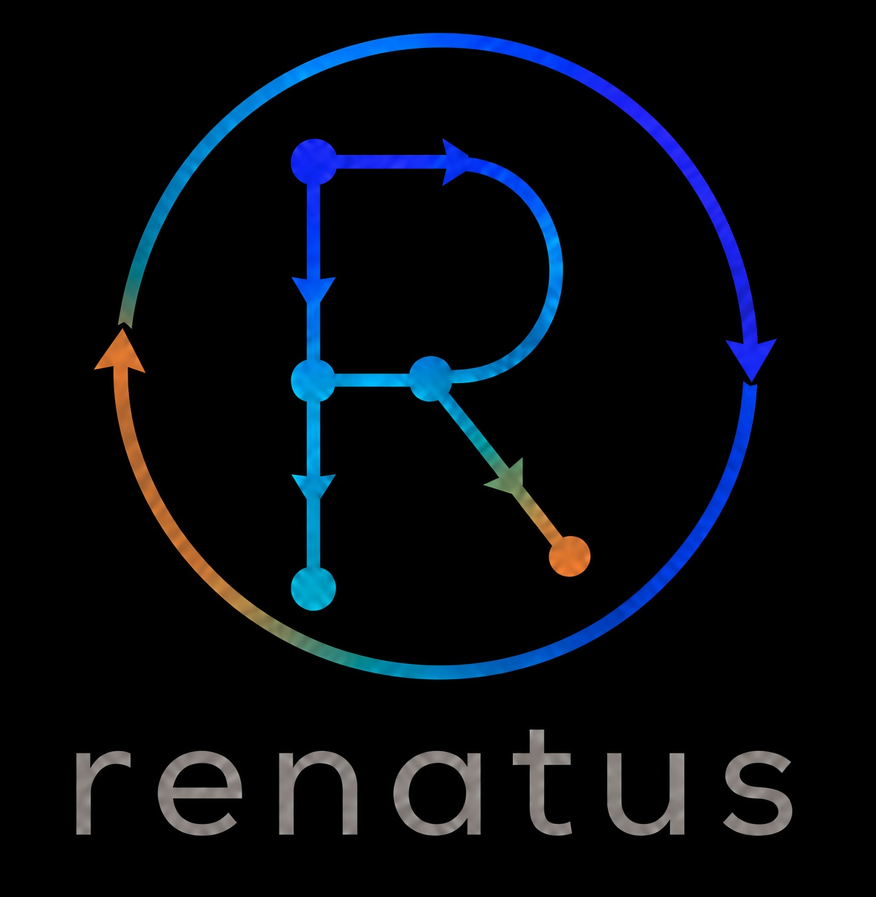

# renatus

<p align="center">
  
</p>

**renatus** vient de *renaitre*. Le projet sert a construire des datasets sur un
flux declaratif : chaque table ou vue peut etre recree a l identique parce
que son **data lineage** est connu et exprime en YAML. On programme la
dependance (`requires`), le script SQL/Python et le mode de creation ; le
moteur materialise les ancetres manquants puis la cible. La GUI web permet de
configurer ce meme graphe de facon graphique.

En resume : un dataset n est pas un artefact opaque. Il peut renaitre tant que
sa recette de flux est la.

## Documentation

| Document | Contenu |
|----------|---------|
| [doc/CORE.md](doc/CORE.md) | Types d etapes, parametres obligatoires et optionnels, exemples YAML |
| [doc/CLI.md](doc/CLI.md) | Ligne de commande oneshot et REPL |
| [doc/API.md](doc/API.md) | API HTTP REST |
| [doc/GUI.md](doc/GUI.md) | GUI web renatus-gui (palette, graphe, config, View, zones, import) |
| [doc/documentation.html](doc/documentation.html) | Presentation HTML (guides + **diagrammes UML** backend/frontend) |
| [doc/ARCHITECTURE.md](doc/ARCHITECTURE.md) | Architecture interne + couches |
| [doc/TESTING_GUI.md](doc/TESTING_GUI.md) | Strategie de tests de l interface |

Logo officiel : [doc/assets/renatus-logo.png](doc/assets/renatus-logo.png)
(vecteur : [renatus-logo.svg](doc/assets/renatus-logo.svg) ; marque : [renatus-mark.png](doc/assets/renatus-mark.png)).

Ouvrir la doc HTML (UML inclus) :

```bash
xdg-open doc/documentation.html
# ou
python -m http.server 8765 --directory doc
# puis http://127.0.0.1:8765/documentation.html
```

## Installation

```bash
python -m venv .venv
source .venv/bin/activate
pip install -e ".[dev]"
pytest
```

Apres un `git pull` qui ajoute ou renomme des commandes (`renatus-gui`, `renatus-cli`…),
reinstaller le package dans le **meme** venv puis recharger le PATH :

```bash
source .venv/bin/activate
pip install -e .
hash -r   # ou: deactivate && source .venv/bin/activate
renatus-gui --help
# fallback si le PATH est casse :
python -m renatus.gui
```

## Surfaces produit

| Surface | Commande | Role |
|---------|----------|------|
| **core** | package `renatus` | Moteur pipeline DuckDB + YAML |
| **cli** | `renatus` / `renatus-cli` | REPL et oneshot |
| **api** | `renatus-api` | Serveur HTTP REST |
| **gui** | `renatus-gui` | Interface web (graphe, config, zones, import) |

## Demarrage rapide

```bash
# CLI (REPL)
renatus mon.duckdb flow/
# alias
renatus-cli mon.duckdb flow/

# API
renatus-api mon.duckdb flow/ --port 8000

# GUI
renatus-gui mon.duckdb flow/
# ou via projet sauvegarde (recommande)
renatus-gui mon.renatus.yaml
```

### Projet (connexion + git)

Un fichier `.renatus.yaml` dans le **dossier projet** enregistre la config de
connexion (`db_path`, `flow_path`, `name`). Ce dossier est un **depot git** :

- **flow/** : YAML des traitements (flux) — **obligatoirement dans le projet**
  (suivi des modifications)
- **db_path** : chemin DuckDB stocke dans le yaml ; le fichier peut rester
  **hors projet** (donnees privees, ignorees par git)
- **sources** (CSV, Excel…) : **referencees** par chemin, non copiees dans le
  repo (l upload GUI vers `input/` / `import_flow/` est local et non versionne)

Detail : [doc/GUI.md](doc/GUI.md).

## Types d etapes (resume)

| Type | Role | Essentiel |
|------|------|-----------|
| `dataframe` | Fichier vers relation | `file`, `mode?` (defaut `create_if_not_exists`) |
| `table` | Table SQL | `script` (SQL), `mode?`, `requires?`, `name?` |
| `view` | Vue SQL | idem table |
| `execute` / `execute_sql` | SQL sans relation | `script`, `requires?` |
| `execute_python` | Script Python (session notebook F0136) | `script`, `venv?`, `timeout?`, `fresh?` |
| `notebook` | Cellule Python interactive (F0137) | editeur type Jupyter Lab + vars session ; `script`, `venv?` |
| `execute_shell` | Shell | `script`, `requires?` |
| `iterate` | Boucle scenarios | `scenarios`, `step_view`, `target`, `order_by?` |
| `zone` | Organisation (onglet) | `label`, `objects`, `workers?`, `renatus_mode?` |
| `flatzone` / `backzone` / `forzone` / `bidzone` | Templates Auto (F0139) | init → **zone** physique + copies YAML (parent / object) |

Detail : [doc/CORE.md](doc/CORE.md). UML classes : [doc/documentation.html](doc/documentation.html#uml-backend).

## Fonctionnalites GUI recentes (extrait)

| Feature | Description |
|---------|-------------|
| Zones multi-onglets | selecteur = **main + zones physiques** (F0131) ; pas de vue `all` par defaut |
| Auto-zones | Palette Auto : flatzone (parent), back/for/bid (object) → **zone** editable des la creation |
| Objects de zone | Liste effective YAML ∪ FS ; popup add/remove |
| Flux | Lineage gris (F0127) ; zoom ; scroll H+V ; croix supprimer sur selection |
| Import flux | Dropzone fichier/dossier ; zones creees visibles apres import |
| View | Pagination datasets (pageSize 3–100) ; une page a la fois |
| Config | View + crayon ; schema / shape / renatus_time ; dialogs themés |
| Id composant | = stem du fichier YAML (`id.yaml`, F0101) |

## Arborescence

| Chemin | Role |
|--------|------|
| `src/renatus/pipeline/` | Moteur DuckDB, steps OOP, projet, git |
| `src/renatus/cli.py` | CLI |
| `src/renatus/api/` | API HTTP |
| `src/renatus/gui/` | GUI web (service, yaml_store, static/app ES modules) |
| `doc/` | Documentation Markdown + HTML UML |
| `tests/` | Tests et fixtures |
| `gestion_projet/` | Suivi de projet (hors package) |

## Principes

- **Lineage** : chaque etape declare ses `requires` ; selection graphe grise le hors-lineage.
- **Renaissance** : recreer une relation en rejouant le graphe, sans mystere.
- **Declaratif** : la verite est dans le YAML (et la GUI le synchronise).
- **Modes** : `create_if_not_exists` ou `create_or_replace` (dataframe/table/view).
- **Organisation** : zones + `objects` (membership multi-zones, copies FS).
- **Auto-zones** : vues logiques recalculees (`allzone`, lineage bac/for/bid).
- **Session Python** (F0136) : `execute_python` partage un noyau persistant (variables entre steps, style notebook) ; `fresh: true` = process neuf.
- **Nommage usuel** : `df_`, `t_`, `v_`, `x_`, `i_` (convention) ; fichier = `<id>.yaml`.

## Exemple minimal

```yaml
# flow/main/df_sales.yaml
df_sales:
  type: dataframe
  label: df_sales
  file: input/sales.csv
  mode: create_if_not_exists   # reutilise en session apres 1er load

# flow/main/t_sales.yaml
t_sales:
  type: table
  mode: create_or_replace
  requires:
    - df_sales
  script: SELECT * FROM df_sales
```

```bash
renatus mon.duckdb flow/ p_table_view t_sales
```

## Architecture UML

Les diagrammes de classes (backend Python + frontend JS), avec **attributs des
classes metiers**, sont dans :

- [doc/documentation.html — UML Backend](doc/documentation.html#uml-backend)
- [doc/documentation.html — UML Frontend](doc/documentation.html#uml-frontend)
- Complement texte : [doc/ARCHITECTURE.md](doc/ARCHITECTURE.md)
